# Message-Driven Architecutre 설계 및 Actor 모델 이해하기

### 목표

1. RCC 축소 모니터링 프로젝트로 시나리오 작성하기
2. 비즈니스 시나리오로 부터 액터를 식별하고 메시지를 정의하기
3. 액터와 메시지를 구현하기

### 아키텍처

**목표**: 임의 서비스 자원을 모니터링한다.
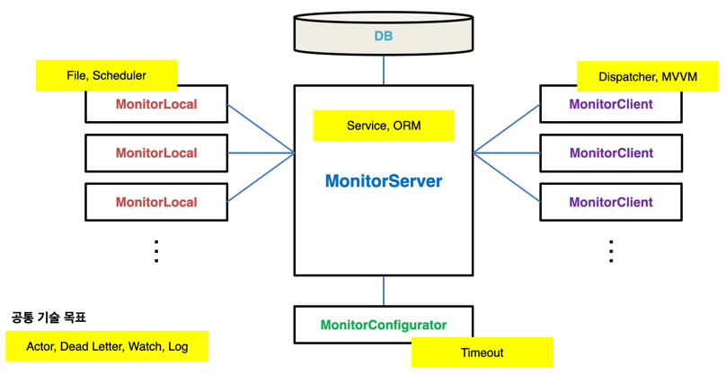

## 1. MonitorLocal 설계

#### 모니터링 대상
1. CPU 사용량(%)
2. 메모리 사용량(%)
#### AppConfig(환경) 파일 구성
1. 액터 시스템 이름
2. IP
3. RetryServerConnectTime(반복적으로 서버와 연결을 시도할 시간)
4. MonitorServer 정보
    1. 액터 시스템 이름
    2. IP / PORT

### (1) 시작할 때
#### 프로세스 메시지 다이어그램
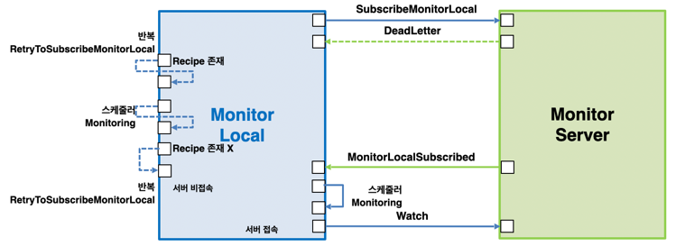
#### 작업 시나리오
1. App.config 파일을 읽는다.
2. MonitorServer에 SubscribeMonitorLocal 메시지를 보낸다.
    1. 서버 접속이 안됐을 때(즉 DeadLetter 메시지를 받았을 때)
        1. 모니터링 Recipe 파일(MonitorRecipe.txt) 파일이 있을 때
            1. MonitorServer 연결 시도를 반복한다.
                1. RetryToSubscribeMonitorLocal 메시지 반복
                2. 간격은 환경정보 읽기(App.config
            2. 모니터링 Recipe 파일이 없을 때
                1. MonitorServer 연결 시도를 반복한다.(간격은 환경정보)
            3. 서버 비접속 상태로 지정한다.
3. MonitorServer로부터 MonitorLocalSubscribed 메시지를 받을 때
    1. 모니터링 Recipe 파일(MonitorRecipe.txt)로 저장한다.
    2. 모니터링 Recipe 기준으로 스케줄링을 시작한다.(Monitoring 메시지 반복 보내기)
    3. MonitorServer 종료(또는 TCP/IP 연결 해제) 감시를 시작한다.
    4. 서버 접속 상태로 지정한다.
#### 액터 메시지 다이어그램/메시지 타입

### (2) 중지할 때
#### 프로세스 메시지 다이어그램
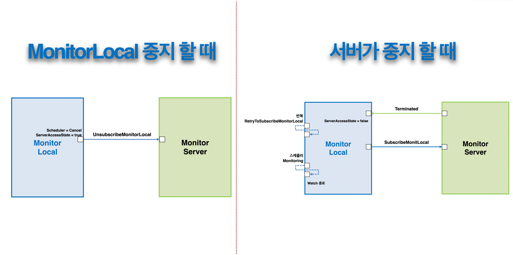
#### 작업 흐름 시나리오
**정상적인 중지 흐름**
1. MonitorLocal에서 스케줄링을 취소한다.
2. LocalServer에 UnsubscribeMonitorLocal 메시지를 보낸다.
3. LocalServer는 ClientServer에 UnsubscribeMonitorLocal 메시지를 보낸다.
**서버가 중지할 때**
1. MonitorServer 종료(또는 TCP/IP 연결 해제) 메시지(Terminated)를 받을 때
    1. 서버 비접속 상태로 변경한다.
    2. MonitorServer 연결 시도를 반복한다.(간격은 환경정보 or App.config)
    3. 모니터링 Recipe 기준으로 스케줄링을 시작한다.(Monitoring 메시지 반복 보내기)
    4. MonitorServer 종료(또는 TCP/IP 연결 해제) 후 감시를 종료한다.
#### 액터 메시지 다이어그램/메시지 타입
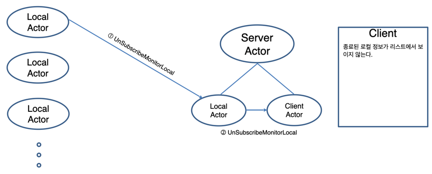

### (3) 모니터링할 때
#### 프로세스 메시지 다이어그램
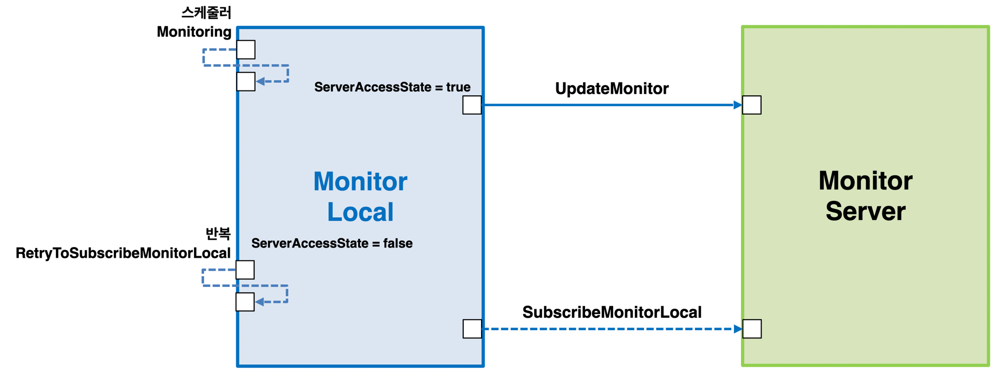
#### 작업 시나리오
1. 스케줄러로부터 Monitoring 메시지 받을 때
    1. 서버 접속 상태 중일 때
        1. 수집된 정보를 LocalServer에게 UpdateMonitor 메시지로 보낸다.
        2. 5초 간격으로 모니터링 데이터를 전송한다.
    2. 서버 비접속 상태 중일 때
        1. MonitorServer 연결 시도를 반복한다.
            1. 간격은 환경정보 or App.config
#### 액터 메시지 다이어그램/메시지 타입
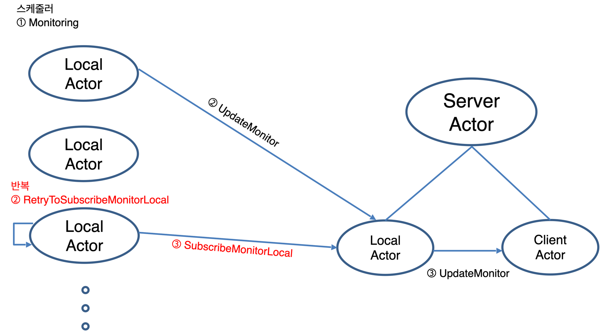

### (4) Recipe가 변경될 때
#### 프로세스 메시지 다이어 그램
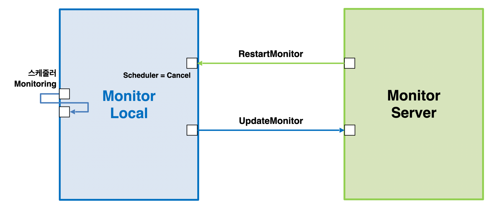
#### 작업 흐름 시나리오
1. MonitorServer로부터 RestartMonitor 메시지를 받을 때
    1. 스케줄링을 취소한다.
    2. 모니터링 Recipe파일(MonitorRecipe.txt)로 저장한다.
    3. 모니터링 Recipe 기준으로 스케줄링을 시작한다(Monitoring 메시지 반복 보내기).

## 2. MonitorConfigurator 설계
### 환경파일 구성(App.config)
1. 액터 시스템 이름
2. IP
3. MonitorServer 정보
    1. 액터 시스템 이름
    2. IP
    3. PORT
4. MessageTimeOut 정보

### 작업 시나리오
#### 프로세스 메시지 다이어 그램
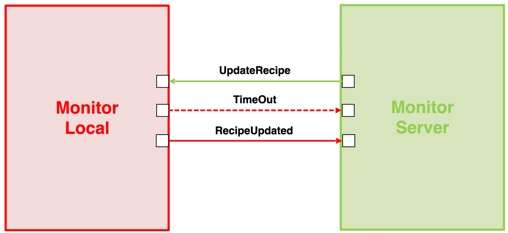
#### Argument 없이 시작할 때 시나리오
1. 환경 파일(App.config)을 읽는다.
2. 모니터링 Recipe 파일(MonitorRecipe.txt)을 읽는다.
3. 모니터링 Recipe을 콘솔에 출력한다.
4. 프로세스를 종료한다.

#### UpdateArgument로 시작할 때 시나리오
1. 환경파일(App.config)을 읽는다.
2. 모니터링 Recipe 파일(MonitorRecipe.txt)을 읽는다.
3. 모니터링 Recipe을 콘솔에 출력한다.
4. MonitorServer에게 UpdateRecipe 메시지를 보낸다.
5. 메시지 타임 아웃을 시작한다.(타임 아웃 시간은 환경 파일, App.config)
6. 타임 아웃 메시지를 받을 때
    1. 타임 아웃 정보를 콘솔에 출력한다.
    2. 모니터링 Recipe 전송 실패를 콘솔에 출력한다.
    3. 프로세스를 종료한다.
7. MonitorServer로 부터 RecipeUpdated 메시지를 받을 때
    1. 모니터링 Recipe전송 성공을 콘솔에 출력한다.
    2. 프로세스를 종료한다.

    
## 3. MonitorClient
### 환경파일(App.config)
1. 액터 시스템 이름
2. IP
3. RetryServerConnectTime(반복적으로 서버와 연결을 시도할 시간)
4. MonitorServer 정보
    1. 액터 시스템 이름
    2. IP
    3. PORT

### (1) 시작할 때
#### 프로세스 메시지 다이어 그램
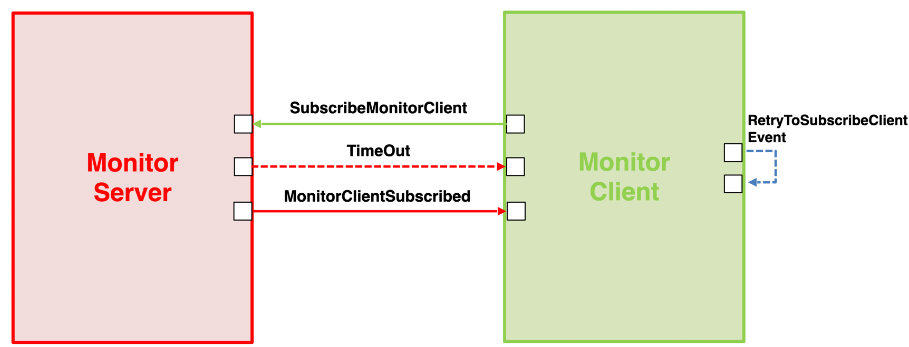
#### 작업 시나리오
1. 환경 파일을 읽는다.
2. MonitorServer에 SubscribeMonitorClient 메시지를 보낸다.
    1. 서버 접속이 안될 때(Dead Letter 메시지를 받을 때)
        1. MonitorServer 연결 시도를 반복한다(간격은 환경정보 App.config)
        2. 서버 비접속 상태로 지정한다.
    2. MonitorServer 종료(또는 TCP/IP 연결 해제) 감시를 시작한다.
    3. MonitorServer로부터 MonitorClientSubscribed 메시지를 받을 때
        1. 서버 접속 상태로 지정한다.
        2. 서버에서 Client의 ID를 지정한다.
        3. Client는 Server로부터 ID를 지정받는다.
#### 액터 메시지 다이어그램/메시지 타입
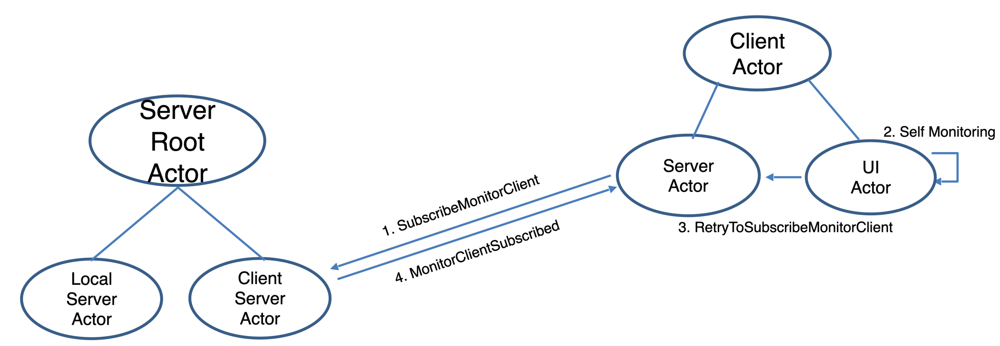

### (2) 중지할 때
#### 프로세스 메시지 다이어 그램
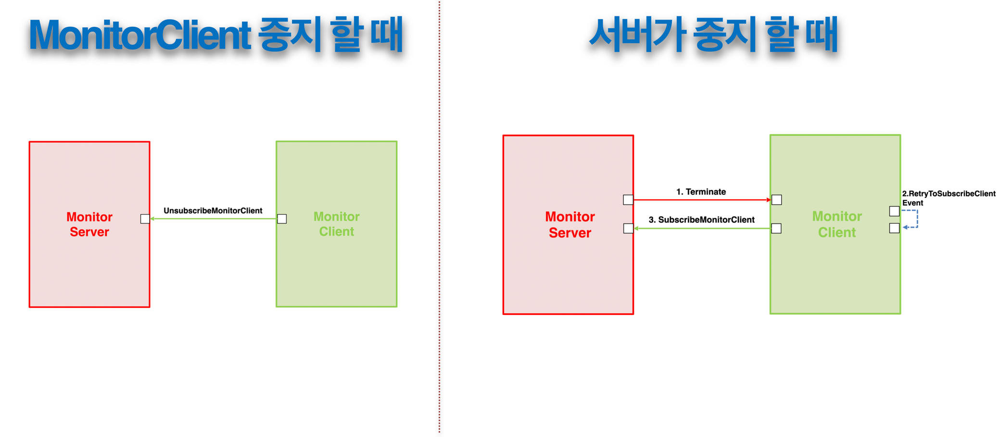
#### 정상적인 종료 시나리오
1. MonitorServer에 UnsubscribeMonitorClient 메시지를 보낸다.
    1. MonitorServer에서 해당 ClientID를 제거한다.
    2. Client에서 Program을 종료한다.
#### 서버가 중지할 때 시나리오
1. MonitorServer 종료(또는 TCP/IP 연결 해제) 메시지를 받을 때
    1. 서버 비접속 상태로 변경한다.
    2. RetryToSubscribeClient 이벤트를 호출하여 Server와 재접속을 시도한다.
#### 액터 메시지 다이어그램/메시지 타입
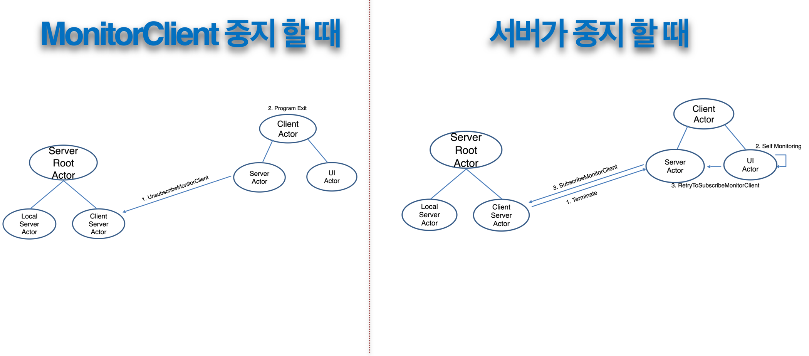

### (3) 모니터링 정보 받을 때
#### 프로세스 메시지 다이어 그램
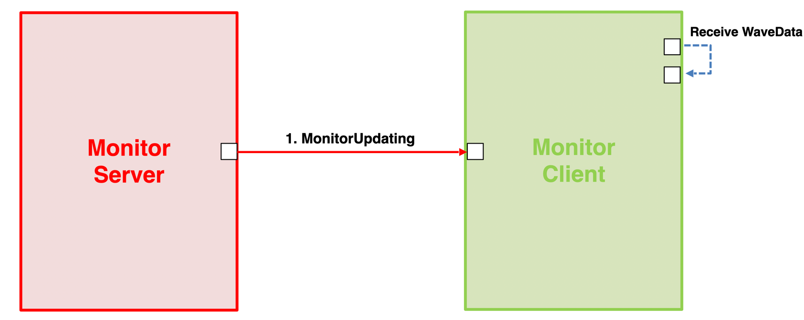
#### 작업 시나리오
1. MonitorServer로부터 MonitorUpdating 메시지 받을 때
    1. Monitor서버에서 해당 Client가 관리하고 있는 Local들을 검색한다.
    2. Client에서 Check된 Local들만 Monitor(CPU, Memory, Disk, Network) 정보를 보낸다.
    3. Client에서는 받은 Monitor 정보를 화면에 출력한다.
#### 액터 메시지 다이어그램/메시지 타입
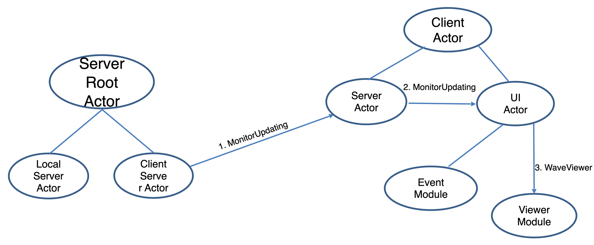

### (4) 검색할 때(서버 접속 상태일 때)
#### 프로세스 메시지 다이어 그램
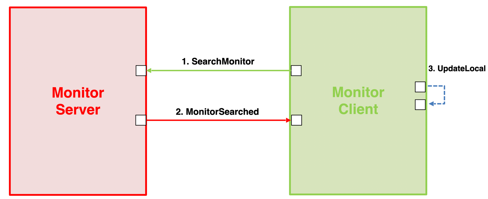
#### 작업 시나리오
1. 검색 기간을 입력 받는다.
    1. Client가 서버에 접속을 하면 먼저 접속된 Local들의 정보를 가져온다.
2. MonitorServer에게 SearchMonitor 메시지를 보낸다.
    1. MonitorServer로 부터 모든 Local(ID 정보, 이름)들을 가져온다.
    2. 가져온 Local(ID 정보, 이름)들을 모든 Client에게 전달한다.
3. MonitorServer로부터 MonitorSearched 메시지를 받을 수 있다.
    1. Client에서 Local(ID 정보, 이름)들을 Client List에 저장한다.
#### 액터 메시지 다이어그램/메시지 타입
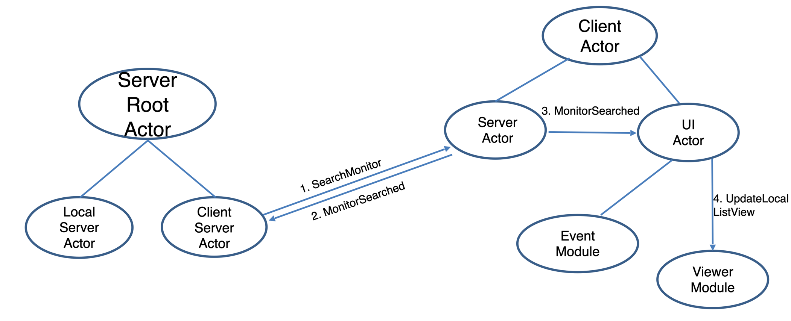

## 4. MonitorServer
#### 프로세스 메시지 다이어 그램

### (1) 시작할 때
#### 작업 시나리오
1. 환경 파일(App.config)을 읽는다.
2. MonitorLocal로부터 SubscribeMonitorLocal 메시지를 받았을 때
    1. LocalActor에게 SubscribeLocal 메시지를 보낸다.
    2. LocalActor는 Local 정보를 저장한다.
    3. MonitorLocal에게 MonitorLocalSubscribed 메시지를 보낸다.
3. MonitorClient로부터 SubscribeMonitorClient 메시지를 받았을 때
    1. Client Actor에게 SubscribeClient 메시지를 보낸다.
    2. Client Actor는 Client 정보를 저장한다.
    3. MonitorClient에게 MonitorClientSubscribed 메시지를 보낸다.

### (2) 중지할 때
#### MonitorServer가 중지할 때 작업 시나리오
1. Server에서 모든 Local 및 Client에 Terminated 메시지를 전달한다.
#### MonitorLocal이 중지할 때 작업 시나리오
1. UnsubscribeMonitorLocal 메시지를 받을 때
    1. Local Actor에 UnsubscribeLocal 메시지를 보낸다.
    2. Local Actor는 해당 로컬을 리스트에 추가한다.
#### MonitorClient가 중지할 때 작업 시나리오
1. Client에서 UnsubscribeMonitorClient 메시지를 전달 받는다.
2. 전달받은 Client 정보를 통해 Client 목록에서 해당 Client를 삭제한다.

### 모니터링할 때
#### 작업 시나리오
1. 연결 접속 후 데이터 수신
    1. MonitorLocal에서 UpdateBulkMonitor 메시지를 받는다.
    2. Client에 MonitorUpdating 메시지를 전송한다.

